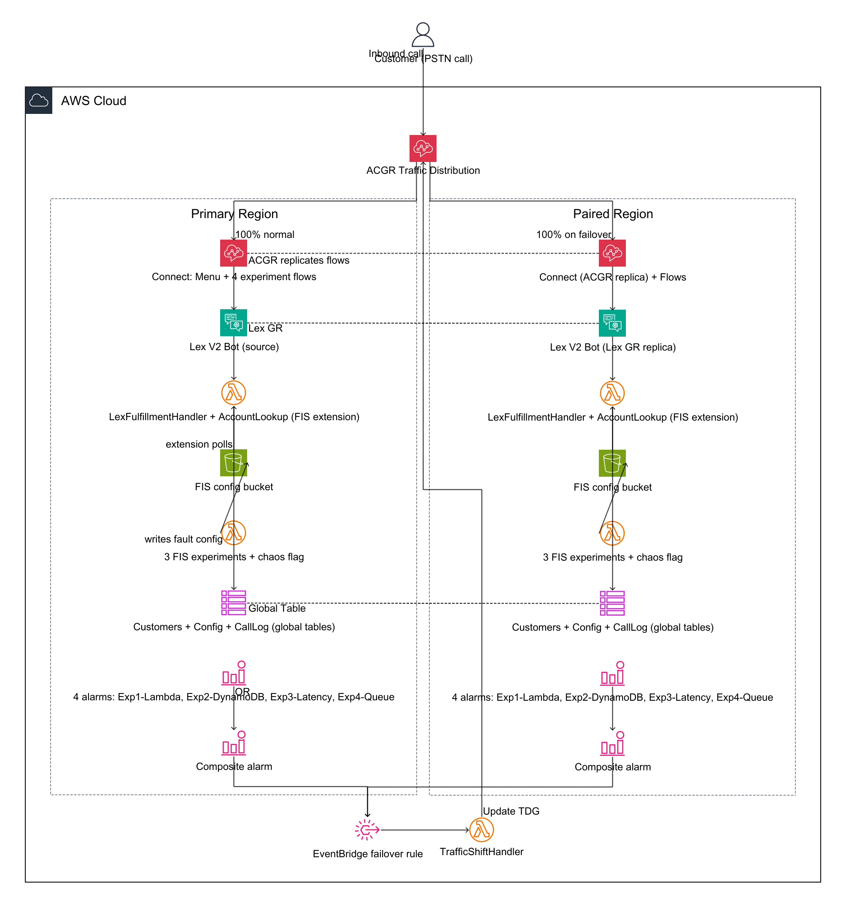

# Amazon Connect Chaos Engineering with FIS & ACGR Failover

> **Requires AWS Enterprise Support.** Amazon Connect Global Resiliency (ACGR) is onboarded
> through your AWS account team. This sample assumes you already have an ACGR-paired Connect
> instance and a Traffic Distribution Group with a **ported** phone number attached.

## Overview

Inject controlled faults into a live Amazon Connect contact centre with **AWS Fault
Injection Service (FIS)**, watch CloudWatch detect them, and verify that **ACGR** shifts
telephony traffic to the healthy paired region — where the call is still answered.

Each experiment has an **attributing metric** that names the failing component, so you can
tell *which* layer broke.

> **On cascades — read this before you judge the results.** Every fault in this sample
> ultimately flows through a Lambda, so `AWS/Lambda Errors` rises during Experiments 1, 2
> and 3. That is inherent to a synchronous IVR call path, not a defect. The composite alarm
> ORs all four component alarms, so failover happens regardless. When demonstrating a
> *specific* experiment, watch **that experiment's own alarm**, not the composite.

**New here?** Follow **[RUNBOOK.md](RUNBOOK.md)**, which also carries a copy/paste block for the currently deployed environment — a sequential deploy-then-test guide with
pre-flight checks, expected results, and the mandatory reset step between experiments.

---

## Architecture



> **[docs/BLOCK-DIAGRAM.md](docs/BLOCK-DIAGRAM.md)** is the detailed block diagram: the call
> path, all four chaos injection points with their timing constraints, and the full
> detection-to-failover chain — annotated with the real resource IDs from a verified
> deployment.

> Diagram source is `docs/architecture.dac.yaml`. Regenerate the PNG with
> `awsdac docs/architecture.dac.yaml --output docs/architecture.png`.

```
                        ┌──────────────────────────────────┐
                        │  Traffic Distribution Group      │
                        │           (ACGR)                 │
                        │  normal:   IAD 100% | PDX 0%     │
                        │  failover: IAD 0%   | PDX 100%   │
                        └───────────────┬──────────────────┘
                                        │
             ┌──────────────────────────┴──────────────────────────┐
       PRIMARY (us-east-1)                              PAIRED (us-west-2)
       ┌──────────────────────┐                    ┌──────────────────────┐
       │ Connect instance     │                    │ Connect instance     │
       │ Contact flows ───────┼── ACGR replicates ►│ Contact flows        │
       │        │             │                    │        │             │
       │        ▼             │                    │        ▼             │
       │ Lex V2 bot ──────────┼──── Lex GR ───────►│ Lex V2 bot (same id) │
       │        │             │                    │        │             │
       │        ▼             │                    │        ▼             │
       │ LexFulfillmentHandler│                    │ LexFulfillmentHandler│
       │ ConnectChaos-        │                    │ ConnectChaos-        │
       │   CallLogger         │                    │   CallLogger         │
       │        │             │                    │        │             │
       │        ▼             │                    │        ▼             │
       │ DynamoDB ────────────┼── global tables ──►│ DynamoDB             │
       │ ConnectChaos-Overflow│                    │ (replicated)         │
       │   queue (no agents)  │                    │                      │
       └──────────────────────┘                    └──────────────────────┘
                    │                                        │
              4 alarms → composite → EventBridge → TrafficShiftHandler
                                        │
                                        ▼
                         UpdateTrafficDistribution (ACGR)
```

---

## Experiments

| # | DTMF | Component | Fault | Attributing metric | Namespace |
|---|:---:|-----------|-------|--------------------|-----------|
| **1** | `1` | Account-lookup Lambda | `aws:lambda:invocation-error` (`preventExecution`) | `ContactFlowErrors` on `ConnectChaos-Exp1-Lambda` | AWS/Connect |
| **2** | `2` | DynamoDB | `aws:network:disrupt-connectivity` scope=`dynamodb` | `ContactFlowErrors` on `ConnectChaos-Exp2-DynamoDB` | AWS/Connect |
| **3** | `3` | Lex code hook | `aws:lambda:invocation-add-delay` (~31 s) | `Duration` (Maximum) | AWS/Lambda |
| **4** | `4` | Contact flow | DynamoDB chaos flag → no-agent queue | `LongestQueueWaitTime` on `ConnectChaos-Overflow` | AWS/Connect |

### How each experiment is kept distinguishable

Amazon Connect publishes exactly **one** metric meaning "a flow failed" — `ContactFlowErrors`
— but it is dimensioned by `ContactFlowName`. Each experiment therefore gets **its own flow**,
which turns that single metric into independent per-experiment signals with no metric math and
no overlap. Three of the four alarms are Connect-native as a result.

Every call starts in **`ConnectChaos-Menu`**, which announces the serving region and offers a
DTMF menu; the digit you press selects the experiment's flow. DTMF rather than speech is
deliberate: during testing ASR turned "one two three four five" into `120345` and once into
`0`, which is indistinguishable from a broken lookup.

Every flow opens with **"Connected in region `$.AwsRegion`"**, so which region served the call
is audible rather than something you reconstruct from two log groups afterwards. That missing
signal is exactly how the defect in [FIXES.md](FIXES.md) Fix 16 stayed hidden.

Each failure path also has its **own prompt**, so the caller experience identifies the fault.
Previously all four experiments ended on one shared "We are experiencing difficulties".

### Experiment 1 — Account-lookup Lambda fails
`ConnectChaos-Exp1-Lambda` collects a 5-digit account number as DTMF ("Store customer input"),
then invokes `ConnectChaos-AccountLookup` **directly**. FIS marks that invocation failed
without running it, so the flow takes the block's Error branch.
- **Alarm:** `ConnectChaos-Exp1-Lambda-{region}` (threshold `ContactFlowErrorsThreshold`, default `0`)
- **Prompt:** *"The account lookup service is unavailable. This is experiment one."*
- A wrong or missing account number does **not** error. The Lambda returns `NOT_FOUND` /
  `INVALID_INPUT` and the flow branches on it with a `Compare` block, so a mistyped number can
  never masquerade as an injected fault.
- **⚠️ 180-second window** — see [Operational constraints](#operational-constraints).

### Experiment 2 — DynamoDB unreachable
FIS blocks both Lambda subnets from the DynamoDB endpoint at the network ACL.
`ConnectChaos-Exp2-DynamoDB` invokes `ConnectChaos-CallLogger` directly (a real audit write),
so the DynamoDB failure takes the flow's Error branch.
- **Alarm:** `ConnectChaos-Exp2-DynamoDB-{region}` (threshold `ContactFlowErrorsThreshold`, default `0`)
- **Prompt:** *"We could not record your call. This is experiment two."*
- The call logger lives **only** in this flow. Putting it in every flow would make an Exp 2
  fault raise `ContactFlowErrors` on all four `ContactFlowName` dimensions at once and destroy
  the attribution this design exists to provide.
- **No 180 s window** — network-level, so the DynamoDB path is severed for the whole
  experiment. **This is the most reliable experiment to demo with a live call.**

### Experiment 3 — Lex code-hook latency
FIS injects a ~31 s startup delay while the function's timeout is 40 s, so the code hook runs
slow but still returns cleanly. Observed as Lambda **Duration**, not an error.
- **Alarm:** `ConnectChaos-Exp3-Latency-{region}` (threshold `LexCodeHookLatencyThresholdMs`, default 7000 ms)
- **Prompt:** *"The lookup service is taking too long. This is experiment three."*
- **The only experiment not alarmed on a Connect metric, deliberately.** It is a *latency*
  fault: the function succeeds, so there may be no flow error at all. A latency threshold is
  the honest measurement. `ContactFlowErrors` for this flow is on the dashboard as an
  observation-only panel; if it proves reliable across runs it could become the alarm.
- **Why not `AWS/Lex RuntimeLambdaErrors`?** It is never emitted for this bot — see
  [FIXES.md](FIXES.md) Fix 7 and its correction. Duration also stays cleanly distinct from
  Exp 1, where the function never runs.
- **⚠️ 180-second window** applies.

### Experiment 4 — Contact flow failure → no-agent queue
A DynamoDB chaos flag makes the fulfillment Lambda return `Failed` to Lex.
`ConnectChaos-Exp4-Queue` routes the failure path to **`ConnectChaos-Overflow`** — a queue
referenced by no routing profile, so no agent can ever receive its contacts — and transfers the
contact there. It waits indefinitely and `LongestQueueWaitTime` climbs.
- **Alarm:** `ConnectChaos-Exp4-Queue-{region}` (threshold `QueueWaitSecondsThreshold`, default 60 s)
- **Prompt:** *"All agents are currently busy. Please hold. This is experiment four."*
- **Why not `MissedCalls`?** It requires a call to be *offered to an agent* and go unanswered
  for 20 s, which is not reproducible without a staffed agent deliberately not answering.
- Not a FIS experiment — you toggle a DynamoDB flag.
- **The flag is region-scoped (`chaos_flag#<region>`) on purpose.** The config table is a Global
  Table, so a single shared key would replicate the fault to the paired Region and failover could
  never recover: the caller would land in a Region reading the same broken row and queueing into
  the same unstaffed queue. This is the one genuinely important lesson in the sample — *a
  dependency failure that lives in replicated data is not a regional failure, and traffic
  shifting will not fix it.* See [FIXES.md](FIXES.md) Fix 25. **Stay on the line ≥ 90 s**, since the
  signal is accumulated queue wait, not a count.

---

## Failover Mechanism

```
any component alarm → composite alarm ALARM
  → EventBridge rule
    → TrafficShiftHandler
      → UpdateTrafficDistribution:  this region 0%  /  other region 100%
```

Each region runs its own `TrafficShiftHandler` that shifts traffic **away from itself**, so
the region detecting the fault initiates the failover. The handler is idempotent — it reads
the current distribution first and no-ops if traffic has already moved.

**Recovery is deliberately manual.** Nothing shifts traffic back automatically, so an
operator can confirm the fault is genuinely resolved first. See Step R in the runbook.

---

## Resources Deployed

| Resource | Primary | Paired | How |
|----------|:---:|:---:|---|
| VPC, 2 private subnets, route table, SG | ✓ | ✓ | Created when `CreateVpc=true` (default) |
| Gateway endpoints — DynamoDB + S3 | ✓ | ✓ | Free; S3 is required by the FIS extension |
| Contact flows — Main IVR + Chaos Test | ✓ | ✓ | Created in primary, ACGR replicates |
| Queue `ConnectChaos-Overflow` + 24×7 hours | ✓ | ✓ | Created in primary, ACGR replicates |
| Lex V2 bot + version + alias | ✓ | ✓ | Primary creates; Lex GR replicates (same IDs) |
| Connect ↔ Lex `IntegrationAssociation` | ✓ | ✓ | Per region, against its local bot |
| `LexFulfillmentHandler` (40 s timeout) | ✓ | ✓ | Per region, same name in both (ACGR requirement) |
| `ConnectChaos-CallLogger` | ✓ | ✓ | Per region; invoked directly by the flow |
| `ConnectChaos-TrafficShiftHandler` | ✓ | ✓ | Requires `EnableAutoFailover=true` |
| DynamoDB global tables ×3 | ✓ | ✓ | Created in primary, auto-replicated |
| S3 — FIS config bucket (`ccfis-…`) | ✓ | ✓ | Created per region |
| FIS experiment templates ×3 | ✓ | ✓ | Per region |
| CloudWatch alarms ×4 + composite | ✓ | ✓ | Per region |
| SNS topic for alarm notifications | ✓ | ✓ | Subscribe manually after deploy |
| Dashboard | ✓ | ✓ | `regional` or `unified` |

---

## Prerequisites

1. **AWS Enterprise Support** (or AWS Unified Operations) — required to onboard ACGR.
2. **ACGR-paired Connect instance**, SAML 2.0 enabled. The replica has the **same instance
   ID** in both regions — that is how you recognise an ACGR pair.
3. **Traffic Distribution Group** with a **ported** phone number attached (claimed-only
   numbers are not eligible for ACGR).
4. Supported region pair: `us-east-1`↔`us-west-2`, `eu-west-2`↔`eu-central-1`, or
   `ap-northeast-1`→`ap-northeast-3`. Enforced by the template's `Rules` block.
5. Ensure Lambda functions have the **same name across regions** and that flows avoid
   hardcoded regions — both handled by this template.

### Required after deploying

`make deploy-pair` creates all the infrastructure but three steps remain, because
CloudFormation cannot perform them. Run:

```bash
make post-deploy STACK=<stack> PRIMARY_REGION=<r1> PAIRED_REGION=<r2> \
  INSTANCE_ID=<connect-instance-id> TDG_ID=<tdg-id>
make verify      STACK=<stack> PRIMARY_REGION=<r1> PAIRED_REGION=<r2> TDG_ID=<tdg-id>
```

| Step | Why CloudFormation cannot do it |
|---|---|
| Seed the DynamoDB tables | Data, not infrastructure |
| **Associate the number with `ConnectChaos-Menu`** | The number belongs to the TDG, not the stack, and no CloudFormation resource models the number → flow link |
| Reset traffic to 100/0 | Live routing state |

> **The association is a silent failure if skipped** — every resource reads
> `CREATE_COMPLETE`, every alarm reads `OK`, and calls never reach the flow.

**You do NOT need to pre-create:** a VPC, subnets, a security group, an S3 bucket, or the
FIS extension layer ARN. All are created or auto-resolved.

---

## Parameters

| Parameter | Required | Default | Notes |
|-----------|:---:|---|---|
| `ConnectInstanceArn` | ✓ | — | ACGR instance ARN for **this** region |
| `ConnectInstanceId` | ✓ | — | Instance UUID for **this** region |
| `TrafficDistributionGroupId` | ✓ | — | TDG that failover updates |
| `LambdaCodeBucket` | ✓ | — | Bucket holding the Lambda zips. `make` creates and fills it |
| `CreateVpc` | | `true` | Create VPC + subnets + free DynamoDB/S3 gateway endpoints |
| `VpcCidr` / `SubnetACidr` / `SubnetBCidr` | | `10.20.0.0/16`, `.1.0/24`, `.2.0/24` | Only when `CreateVpc=true` |
| `LambdaSubnetIdA` / `IdB` / `LambdaSecurityGroupId` | | `''` | **Only when `CreateVpc=false`.** A Rule enforces all three |
| `FISExtensionLayerArn` | | *SSM path* | Auto-resolves per region. Override only to pin a version |
| `PrimaryRegion` / `PairedRegion` | | `us-east-1` / `us-west-2` | Must be an ACGR pair |
| `EnableAutoFailover` | | `false` | Deploy EventBridge + `TrafficShiftHandler` |
| `EnableLexGlobalResiliency` | | `true` | Replicate the bot via Lex GR (IAD↔PDX, LHR↔FRA) |
| `ReplicatedLexBotId` / `…AliasId` | | `''` | Paired region only; from the primary stack outputs |
| `EnableTrafficGenerator` | | `false` | Synthetic metrics — drive alarms without phone calls |
| `DashboardType` | | `regional` | `regional` or `unified` |
| `ContactFlowErrorsThreshold` | | `0` | Exps 1 and 2. `0` = one flow error trips the alarm. Raise for production monitoring |
| `LexCodeHookLatencyThresholdMs` | | `7000` | Exp 3 |
| `QueueWaitSecondsThreshold` | | `60` | Exp 4 |
| `FailoverDelaySeconds` | | `120` | How long to HOLD the failover after the alarm fires, so callers can experience the impaired Region. `0` = shift immediately |
| `FISExperimentDuration` | | `PT5M` | ISO-8601 |
| `PairedConnectInstanceId` | | `''` | Primary only, when `DashboardType=unified` |

---

## Deployment

### Which file do I deploy?

**`cfn/main-template.yaml`** — the only deployable artifact.

| Path | Role |
|---|---|
| **`cfn/main-template.yaml`** | **The template.** Deployed once per region |
| `lambda/*.py` | Zipped and uploaded by `make`; source of truth for the code |
| `Makefile` | Creates the bucket, packages, uploads, deploys |
| `RUNBOOK.md` | Step-by-step deploy + test guide |
| `scripts/wire-paired-flow.sh` | Post-deploy, **only** if `EnableLexGlobalResiliency=false` |
| `contact-flows/*.json` | Reference copies — **not deployed**. Live flows are inline in the template |

The same template deploys **twice**; `IsPrimaryRegion` controls what goes where. The global
tables, both contact flows, the overflow queue and its hours of operation are created only
in the primary region and replicated by ACGR / DynamoDB.

### Recommended: deploy both regions in one command

```bash
export ACCT=$(aws sts get-caller-identity --query Account --output text)
export PRIMARY_REGION=us-east-1
export PAIRED_REGION=us-west-2

# ACGR replicas share the SAME instance id, so both ARNs differ only by region
export PRIMARY_INSTANCE_ARN=arn:aws:connect:$PRIMARY_REGION:$ACCT:instance/<instance-id>
export PAIRED_INSTANCE_ARN=arn:aws:connect:$PAIRED_REGION:$ACCT:instance/<instance-id>
export TDG_ID=<traffic-distribution-group-id>

make deploy-pair STACK=connect-chaos-sample \
  PRIMARY_REGION=$PRIMARY_REGION PAIRED_REGION=$PAIRED_REGION \
  PRIMARY_INSTANCE_ARN=$PRIMARY_INSTANCE_ARN \
  PAIRED_INSTANCE_ARN=$PAIRED_INSTANCE_ARN \
  TDG_ID=$TDG_ID
```

`deploy-pair` creates the code bucket, packages and uploads the Lambdas, deploys the primary
region, reads the Lex GR bot/alias IDs from its outputs, then deploys the paired region with
those IDs. **Both stacks are left standing** — required for the paired region to actually
serve a call after failover.

### One region at a time

```bash
make deploy STACK=connect-chaos-sample REGION=$PRIMARY_REGION \
  CONNECT_INSTANCE_ARN=$PRIMARY_INSTANCE_ARN \
  CONNECT_INSTANCE_ID=<instance-id> TDG_ID=$TDG_ID
```

Then read `LexBotId` / `LexBotAliasId` from the primary outputs and pass them to the paired
region as `REPLICATED_LEX_BOT_ID` / `REPLICATED_LEX_BOT_ALIAS_ID`.

> **Tokyo/Osaka:** Lex GR does not support `ap-northeast-1`↔`ap-northeast-3`. Deploy both
> with `ENABLE_LEX_GR=false`, omit the replicated IDs, then run
> `./scripts/wire-paired-flow.sh` to point the paired flow at its own bot.

### Seed the test data

```bash
aws dynamodb put-item --table-name $STACK-Customers --region $PRIMARY_REGION \
  --item '{"account_id":{"S":"12345"},"customer_name":{"S":"John Doe"}}'
aws dynamodb put-item --table-name $STACK-Config --region $PRIMARY_REGION \
  --item '{"config_key":{"S":"chaos_flag#us-east-1"},"enabled":{"BOOL":false}}'
```

---

## Operational constraints

Real behaviours you must account for. None are template bugs.

### The FIS Lambda extension has a ~180 s config-freshness window (Exp 1 & 3)

Experiments 1 and 3 work through the FIS Lambda extension layer, which reads its fault
config from S3, polls roughly every 60 s, and **ignores config older than ~180 s**.

- A real call must land **within ~3 minutes** of starting the experiment, or the invocation
  runs normally with no fault applied.
- If you miss the window, restart the experiment and call again promptly.

Experiment 2 is network-level and has **no such window**.

### The template exceeds CloudFormation's inline limit

At ~65 KB it is over the 51,200-byte `TemplateBody` limit, so deploys must stage it through
S3. `make deploy` does this automatically via `--s3-bucket`. For StackSets use
`--template-url`.

### A failed first-create is auto-deleted

`aws cloudformation deploy` rolls back and deletes a brand-new stack that fails, discarding
the events you need. To keep it for inspection use
`aws cloudformation create-stack --on-failure DO_NOTHING`, read
`describe-stack-events`, then delete manually.

### Every fault also raises `AWS/Lambda Errors`

See the cascade note in the Overview. Watch the specific experiment's alarm.

---

## Running Experiments

Full procedure with verification and the mandatory reset step: **[RUNBOOK.md](RUNBOOK.md)**.

```bash
get_out () { aws cloudformation describe-stacks --stack-name connect-chaos-sample \
  --region $1 --query "Stacks[0].Outputs[?OutputKey=='$2'].OutputValue" --output text; }

aws fis start-experiment --region $PRIMARY_REGION \
  --experiment-template-id $(get_out $PRIMARY_REGION FISExperiment1)   # Exp 1
aws fis start-experiment --region $PRIMARY_REGION \
  --experiment-template-id $(get_out $PRIMARY_REGION FISExperiment2)   # Exp 2
aws fis start-experiment --region $PRIMARY_REGION \
  --experiment-template-id $(get_out $PRIMARY_REGION FISExperiment3)   # Exp 3
```

Experiment 4 is a flag, not a FIS experiment:

```bash
# enable
aws dynamodb put-item --table-name $STACK-Config --region $PRIMARY_REGION \
  --item '{"config_key":{"S":"chaos_flag#us-east-1"},"enabled":{"BOOL":true}}'
# disable — this does NOT expire on its own
aws dynamodb put-item --table-name $STACK-Config --region $PRIMARY_REGION \
  --item '{"config_key":{"S":"chaos_flag#us-east-1"},"enabled":{"BOOL":false}}'
```

Each FIS experiment's stop condition is its **own** alarm, so it halts as soon as it
succeeds. Failover still fires — the alarm and EventBridge act independently.

---

## Synthetic Traffic Generator (Optional)

Set `EnableTrafficGenerator=true` (the `make` targets default it to `true`) to drive every
alarm without placing phone calls. Deploys `ConnectChaos-TrafficGenerator-{region}` plus a
**disabled** EventBridge schedule.

```bash
GEN=ConnectChaos-TrafficGenerator-$PRIMARY_REGION

aws lambda invoke --function-name $GEN --region $PRIMARY_REGION \
  --payload '{"mode":"healthy","count":10}' /dev/stdout

# Exp 1 | Exp 2 | Exp 3 | Exp 4 | everything
--payload '{"mode":"faulty","fault_type":"lambda","count":10}'
--payload '{"mode":"faulty","fault_type":"dynamodb","count":10}'
--payload '{"mode":"faulty","fault_type":"lex","count":10}'
--payload '{"mode":"faulty","fault_type":"flow","count":10}'
--payload '{"mode":"faulty","fault_type":"all","count":10}'
```

The generator emits metrics with the **same namespaces and dimensions** as real traffic, so
CloudWatch cannot distinguish them and the full alarm → failover chain fires.

> **⚠️** Synthetic points are indistinguishable from real ones on your dashboard. Stop the
> generator and disable the schedule when finished.
>
> **Note on `fault_type=lex`:** it emits `RuntimeLambdaErrors` under `RecognizeUtterance`,
> which is *not* what a real Connect voice call produces. It exercises the metric, but
> Experiment 3's real-call signal is Lambda `Duration`.

---

## Monitoring

Dashboard `ConnectChaos-{region}`:

1. **Exp 1** — Lambda `Errors`
2. **Exp 2** — `ContactFlowErrors` (summed across both flow names)
3. **Exp 3** — `LexFulfillmentHandler` `Duration` (Maximum, ms)
4. **Exp 4** — `LongestQueueWaitTime` on `ConnectChaos-Overflow` (Maximum, sec)

An `AlarmNotificationTopic` SNS topic fires on composite alarm and OK. Subscribe an email
in the console — no subscription is pre-created because it would need confirmation.

---

## Cost

| Service | Driver |
|---------|--------|
| Amazon Connect | Per-minute telephony + daily active use |
| AWS FIS | ~$0.10 per action-minute |
| Lambda | Invocations + duration (negligible) |
| DynamoDB | On-demand R/W (negligible) |
| CloudWatch | 5 alarms ≈ $0.50/mo + dashboard $3/mo |
| Lex V2 | Per request during testing |
| S3 | FIS config + template staging (< $0.01/mo) |
| **VPC** | **$0** — gateway endpoints are free, no NAT gateway is created |

**All experiments once:** < $5, excluding telephony. **Left standing:** roughly
$10–15/month per region, mostly dashboards and alarms.

---

## Security

- **Sample only.** Do not run FIS experiments against a production contact centre without
  blast-radius planning.
- Every experiment has a **stop condition** tied to its own alarm.
- The created VPC has **no internet gateway and no NAT** — only free gateway endpoints to
  DynamoDB and S3.
- The FIS config bucket blocks all public access; only the FIS and Lambda execution roles
  can reach it.
- IAM roles are least-privilege. Review before deploying.

---

## Cleanup

> The FIS config bucket (`ccfis-{account}-{region}-{stack}`) must be **emptied first** —
> CloudFormation cannot delete a non-empty bucket and the stack will hit `DELETE_FAILED`.

```bash
ACCT=$(aws sts get-caller-identity --query Account --output text)
STACK=connect-chaos-sample

for R in $PAIRED_REGION $PRIMARY_REGION; do
  aws s3 rm "s3://ccfis-${ACCT}-${R}-${STACK}/" --recursive --region $R
done

# delete PAIRED first, then PRIMARY
aws cloudformation delete-stack --stack-name $STACK --region $PAIRED_REGION
aws cloudformation wait stack-delete-complete --stack-name $STACK --region $PAIRED_REGION
aws cloudformation delete-stack --stack-name $STACK --region $PRIMARY_REGION

# optional: the code/staging bucket
# aws s3 rb s3://connect-chaos-code-${ACCT}-${PRIMARY_REGION} --force --region $PRIMARY_REGION
```

Paired before primary: the DynamoDB global tables are owned by the primary stack. With Lex
GR enabled, the replica bot is removed when the primary bot is deleted.

---

## Key Design Decisions

| Decision | Rationale |
|----------|-----------|
| Attributing metric per experiment, not isolation | All faults also raise `Lambda Errors`; only each experiment's own metric names the cause |
| Exp 3 uses Lambda `Duration`, not `RuntimeLambdaErrors` | That Lex metric is never emitted on Connect's real `StartConversation` voice path (FIXES.md Fix 7) |
| Exp 2 invokes a call-logger directly from the flow | Otherwise `ContactFlowErrors` never fired and Exp 2 only rode the Lambda-Errors alarm (Fix 6) |
| Exp 4 uses a no-agent queue + `LongestQueueWaitTime` | `MissedCalls` needs a staffed agent to deliberately not answer — not reproducible |
| `$.AwsRegion` in the flow's Lex ARN | ACGR replicates flow content verbatim; a hardcoded region makes the paired region call the **primary's** bot, defeating failover |
| Explicit `IntegrationAssociation` per region | A Lex bot must be associated with the instance before a flow can invoke it (Fix 5) |
| `CreateVpc=true` with free gateway endpoints | Removes the VPC prerequisite at no cost. S3 reachability is mandatory — the FIS extension reads its config from S3 |
| FIS layer ARN from public SSM | Both the publishing account **and** version differ per region, so a hand-copied ARN fails silently |
| Composite alarm has explicit `DependsOn` | The rule names children in a `!Sub` literal, so CloudFormation cannot infer the dependency and creation races (Fix 1) |
| Manual recovery | An operator should confirm the fault is resolved before customers are routed back |

---

## Directories

| Path | Purpose |
|---|---|
| `cfn/` | The deployable template |
| `lambda/` | Function source — zipped and uploaded by `make` |
| `contact-flows/` | Reference JSON copies (not deployed) |
| `scripts/` | `wire-paired-flow.sh`, needed only when Lex GR is off |
| `docs/` | Architecture diagram + source |

---

## Tooling

```bash
make bucket   REGION=us-east-1     # create the code/staging bucket (idempotent)
make package                       # zip all four Lambdas
make bootstrap REGION=us-east-1    # bucket + package + upload
make deploy      STACK=... REGION=... CONNECT_INSTANCE_ARN=... CONNECT_INSTANCE_ID=... TDG_ID=...
make deploy-pair STACK=... PRIMARY_REGION=... PAIRED_REGION=... \
                 PRIMARY_INSTANCE_ARN=... PAIRED_INSTANCE_ARN=... TDG_ID=...
make post-deploy STACK=... PRIMARY_REGION=... PAIRED_REGION=... INSTANCE_ID=... TDG_ID=...
make verify      STACK=... PRIMARY_REGION=... PAIRED_REGION=... TDG_ID=...
make reset       STACK=... PRIMARY_REGION=... PAIRED_REGION=... TDG_ID=...  # between experiments
make flows                         # regenerate contact-flows/*.json from the template
make lint                          # cfn-lint, bash -n, py_compile, JSON, flow drift
make clean
```

Run `make lint` before committing. There is no CI in this repo; validation is local.

`-i W1030` is expected: the `ReplicatedLexBot*` parameters are intentionally empty in
primary-region deploys.

---

## Known findings

[FIXES.md](FIXES.md) records every defect found by deploying this against a real
ACGR-paired instance, the fix applied, and the things that are **not** bugs. Read it before
changing an experiment's metric — several obvious-looking "fixes" have already been proven
wrong by real calls.

---

## License

MIT-0. See [LICENSE](LICENSE).
